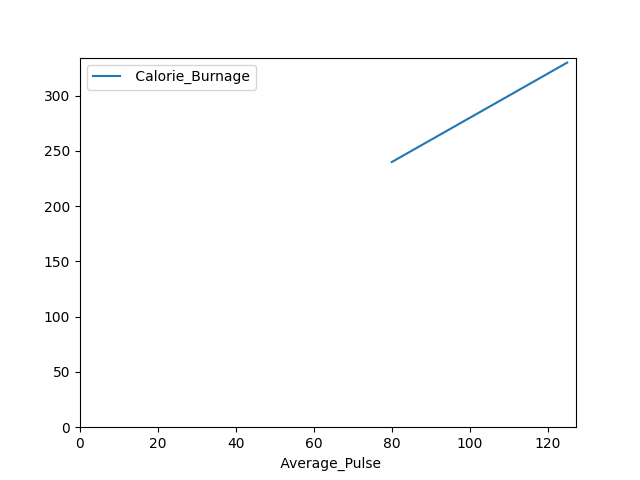

# WHAT IS DATA SCIENCE?

Data Science is about data gathering, analysis and decision-making. It is about finding patterns in data, through analysis, and make future predictions.

By using Data Science, companies are able to make:

1. Better decisions (should we choose A or B)
2. Predictive analysis (what will happen next?)
3. Pattern discoveries (find pattern, or maybe hidden information in the data.


## How does Data Scientist Work?
A Data Scientist requires expertise in several backgrounds:

- Machine Learning
- Statistics
- Programming (Python or R)
- Mathematics
- Databases
A Data Scientist must find patterns within the data. Before he/she can find the patterns, he/she must organize the data in a standard format.

- Here is how a Data Scientist works:

1. Ask the right questions - To understand the business problem.
2. Explore and collect data - From database, web logs, customer feedback, etc.
3. Extract the data - Transform the data to a standardized format.
4. Clean the data - Remove erroneous values from the data.
5. Find and replace missing values - Check for missing values and replace them with a suitable value (e.g. an average value).
6. Normalize data - Scale the values in a practical range (e.g. 140 cm is smaller than 1.8 m. However, the number 140 is larger than 1.8 - so scaling is important).
7. Analyze data, find patterns and make future predictions.
8. Represent the result - Present the result with useful insights in a way the "company" can understand.

## PYTHON LIBRARIES
Python is a widely used programming language by Data Scientists.
In this course, we will use the following Python libraries:

- Pandas
- Numpy
- Matplotlib
- SciPy

1. Create your Virtual Environment, etc.
2. Install Pandas `pip install pandas`

### PANDAS
` pandasintro.py `
- Import the Pandas library as pd
- Define data with column and rows in a variable named d
- Create a data frame using the function pd.DataFrame() -- (note the Capital D and F)
- The data frame contains 3 columns and 5 rows
- Print the data frame output with the print() function

Before analyzing data, a Data Scientist must extract the data, and make it clean and valuable.

#### EXTRACT DATA
` extracting_data.py `

Pandas is a library in Python used for data analysis and data manipulation.
To import data, we us `read_csv()` function to import CSV file.
- Import the Pandas library
- Name the data frame as health_data.
- header=0 means that the headers for the variable names are to be found in the first row (note that 0 means the first row in Python)
- sep="," means that "," is used as the separator between the values. This is because we are using the file type .csv (comma separated values)

POINTS TO NOTE:
1. Blank rows - data set loaded using Pandas automatically converts blank cells to NaN
2. `dropna()` function can be used to remove NaNs
``` py3
health_data.dropna(axis=0,inplace=True)
print(health_data)
```
3. `axis=0` means that we want to remove all rows that have a NaN value

##### DATA CATEGORIES
Data can be split into three main categories:

1. Numerical - Contains numerical values. Can be divided into two categories:
    -  Discrete: Numbers are counted as "whole". Example: You cannot have trained 2.5 sessions, it is either 2 or 3
    - Continuous: Numbers can be of infinite precision. For example, you can sleep for 7 hours, 30 minutes and 20 seconds, or 7.533 hours
2. Categorical - Contains values that cannot be measured up against each other. Example: A color or a type of training
3. Ordinal - Contains categorical data that can be measured up against each other. Example: School grades where A is better than B and so on

##### ANALYSE DATA
We can use `describe()` function in Python to summarize data

- Count - Counts the number of observations
- Mean - The average value
- Std - Standard deviation (explained in the statistics chapter)
- Min - The lowest value
- 25%, 50% and 75% are percentiles (explained in the statistics chapter)
- Max - The highest value

#### DS MATHS
Mathematical functions are important to know as a data scientist, because we want to make predictions and interpret them.

### LINEAR FUNCTIONS
Here, a function is used to relate one variable to another variable.

A linear function has one independent variable (x) and one dependent variable (y).

If we consider the relationship between calorie burnage and average pulse. It is reasonable to assume that, in general, the calorie burnage will change as the average pulse changes - we say that the calorie burnage depends upon the average pulse.

Furthermore, it may be reasonable to assume that as the average pulse increases, so will the calorie burnage. Calorie burnage and average pulse are the two variables being considered.

Because the calorie burnage depends upon the average pulse, we say that calorie burnage is the dependent variable and the average pulse is the independent variable.

` y = f(x) = ax + b `

This function is used to calculate a value for the dependent variable when we choose a value for the independent variable.

Explanation:
- f(x) = the output (the dependant variable)
- x = the input (the independant variable)
- a = slope = is the coefficient of the independent variable. It gives the rate of change of the dependent variable
- b = intercept = is the value of the dependent variable when x = 0. It is also the point where the diagonal line crosses the vertical axis.

#### Linear Function With One Explanatory Variable
A function with one explanatory variable means that we use one variable for prediction.

Let us say we want to predict calorie burnage using average pulse. We have the following formula:  

` f(x) = 2x + 80 `

Here, the numbers and variables means:
- f(x) = The output. This number is where we get the predicted value of Calorie_Burnage
- x = The input, which is Average_Pulse
- 2 = Slope = Specifies how much Calorie_Burnage increases if Average_Pulse increases by one. It tells us how "steep" the diagonal line is
- 80 = Intercept = A fixed value. It is the value of the dependent variable when x = 0

#### PLOTTING LINEAR FUNCTION
Linear means "straight line".

In plotting a graph, key factors:
- Horizontal axis is the X axis
- Vertical Axis is the Y axis

### MATPLOTLIB 
we will plot the values of Average_Pulse against Calorie_Burnage using the matplotlib library.
The `plot()` function is used to make a 2D hexagonal binning plot of points x,y

` matplotlibintro.py `


Example Explained:
- Import the pyplot module of the matplotlib library
- Plot the data from Average_Pulse against Calorie_Burnage
- ` kind='line' ` tells us which type of plot we want. Here, we want to have a straight line
- ` plt.ylim() ` and ` plt.xlim() ` tells us what value we want the axis to start on. Here, we want the axis to begin from zero
- ` plt.show() ` shows us the output

The picture(graph) explained:
1. There is a relationship between Average_Pulse and Calorie_Burnage. Calorie_Burnage increases proportionally with Average_Pulse. It means that we can use Average_Pulse to predict Calorie_Burnage.
2. The reason the line doesn't start from 0, 80 is the first observation of Average_Pulse and 240 is the first observation of Calorie_Burnage.
3. As it turns out:
    - If the average pulse is 80, the calorie burnage is 240
    - If the average pulse is 90, the calorie burnage is 260
    - If the average pulse is 100, the calorie burnage is 280
- There is a pattern. If average pulse increases by 10, the calorie burnage increases by 20.

SLOPE AND INTERCEPT:

` f(x) = 2x + 80 `